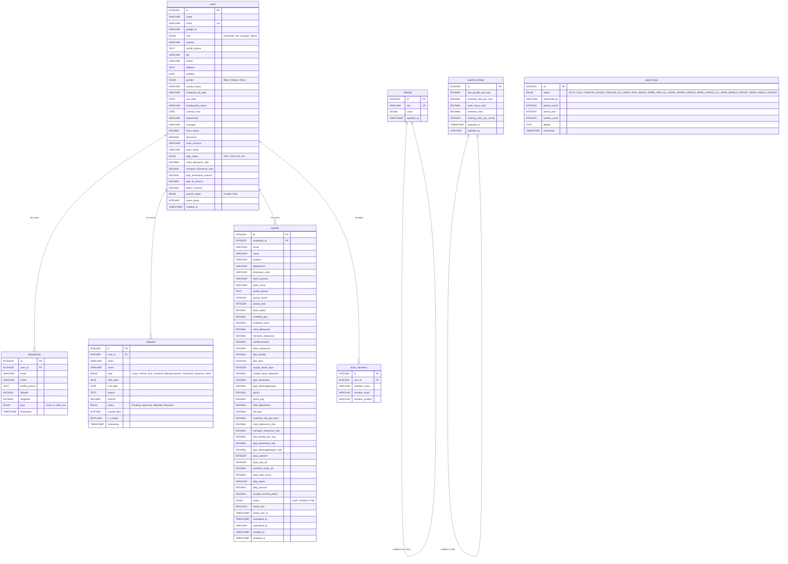

# Database Schema
## EMS — Employee Management System
**Database:** PostgreSQL (Relational Database)
**ORM:** Sequelize
**Last Updated:** 28 Mei 2026

---

## Entity Relationship Diagram



---

## 1. Tabel: `users`
Model file: `server/models/User.js`

Menyimpan semua data profil, jabatan, dan konfigurasi payroll karyawan.

| Field | Type | Default | Keterangan |
|-------|------|---------|------------|
| `id` | INTEGER | Auto Inc | Primary Key |
| `name` | VARCHAR | - | Nama Karyawan |
| `email` | VARCHAR | - | Email Karyawan (Unique) |
| `google_id` | VARCHAR | - | Google OAuth ID |
| `role` | ENUM | 'employee' | Hak akses sistem (employee, hrd, manager, admin) |
| `position` | VARCHAR | 'Staff' | Posisi jabatan |
| `profile_picture` | TEXT | - | URL foto profil (dari Google) |
| `bio` | VARCHAR(250) | '-' | Bio singkat karyawan |
| `phone` | VARCHAR | '-' | Nomor telepon |
| `address` | TEXT | '-' | Alamat lengkap |
| `birthday` | DATE | - | Tanggal lahir |
| `gender` | ENUM | '-' | Male, Female, Other, - |
| `marital_status` | VARCHAR | '-' | Status pernikahan |
| `employee_id_code` | VARCHAR | 'EMS-000' | ID karyawan internal |
| `join_date` | DATE | NOW() | Tanggal bergabung |
| `employment_status` | VARCHAR | 'Probation' | Probation, Full-time, Contract |
| `contract_end` | DATE | - | Tanggal berakhir kontrak |
| `department` | VARCHAR | 'General' | Departemen |
| `manager` | VARCHAR | 'HR Manager' | Nama manager |
| `base_salary` | DECIMAL(15,2) | 5000000 | Gaji Pokok |
| `allowance` | DECIMAL(15,2) | 0 | Tunjangan tetap |
| `bank_account` | VARCHAR | '-' | Nomor rekening bank |
| `bank_name` | VARCHAR | '-' | Nama bank |
| `ptkp_status` | ENUM | 'TK/0' | Status PTKP pajak (TK/0..TK/3, K/0..K/3) |
| `meal_allowance_rate` | DECIMAL(15,2) | 25000 | Rate tunjangan makan per hari |
| `transport_allowance_rate` | DECIMAL(15,2) | 20000 | Rate tunjangan transport per hari |
| `bpjs_kesehatan_amount` | DECIMAL(15,2) | 1 | Potongan BPJS Kesehatan |
| `bpjs_tk_amount` | DECIMAL(15,2) | 1 | Potongan BPJS Ketenagakerjaan |
| `pph21_amount` | DECIMAL(15,2) | 1 | Potongan PPh 21 |
| `payroll_status` | ENUM | 'Unpaid' | Status pembayaran (Unpaid, Paid) |
| `leave_quota` | INTEGER | 0 | Sisa jatah cuti |
| `created_at` | TIMESTAMP | NOW() | Waktu pembuatan akun |

---

## 2. Tabel: `attendances`
Model file: `server/models/Attendance.js`

Menyimpan catatan clock-in dan clock-out harian.

| Field | Type | Default | Keterangan |
|-------|------|---------|------------|
| `id` | INTEGER | Auto Inc | Primary Key |
| `user_id` | INTEGER | - | Foreign Key ke `users.id` |
| `email` | VARCHAR | - | Email karyawan (denormalisasi) |
| `name` | VARCHAR | - | Nama karyawan (denormalisasi) |
| `profile_picture` | TEXT | - | Foto profil saat absen |
| `latitude` | DECIMAL(10,7) | - | Koordinat lintang |
| `longitude` | DECIMAL(10,7) | - | Koordinat bujur |
| `type` | ENUM | 'clock_in' | 'clock_in' atau 'clock_out' |
| `timestamp` | TIMESTAMP | NOW() | Waktu pencatatan |

---

## 3. Tabel: `requests`
Model file: `server/models/Request.js`

Menyimpan permohonan cuti, izin, lembur, dan reimburse.

| Field | Type | Default | Keterangan |
|-------|------|---------|------------|
| `id` | INTEGER | Auto Inc | Primary Key |
| `user_id` | INTEGER | - | Foreign Key ke `users.id` |
| `email` | VARCHAR | - | Email pemohon |
| `name` | VARCHAR | - | Nama pemohon |
| `type` | ENUM | - | Leave, Permit, Sick, Overtime, Reimbursement, Timesheet, Expense, Other |
| `start_date` | DATE | - | Tanggal mulai |
| `end_date` | DATE | - | Tanggal selesai |
| `reason` | TEXT | - | Alasan permohonan |
| `amount` | DECIMAL(15,2) | - | Nominal (untuk Reimbursement/Expense) |
| `status` | ENUM | 'Pending' | Pending, Approved, Rejected, Returned |
| `unpaid_days` | INTEGER | 0 | Jumlah hari cuti tidak berbayar |
| `is_unpaid` | BOOLEAN | false | Flag cuti tidak berbayar |
| `timestamp` | TIMESTAMP | NOW() | Waktu pengajuan |

---

## 4. Tabel: `payrolls`
Model file: `server/models/Payroll.js`

Menyimpan hasil kalkulasi payroll per karyawan per periode (bulan/tahun). Setiap record merepresentasikan slip gaji lengkap.

### Identitas Karyawan

| Field | Type | Default | Keterangan |
|-------|------|---------|------------|
| `id` | INTEGER | Auto Inc | Primary Key |
| `employee_id` | INTEGER | - | Foreign Key ke `users.id` |
| `email` | VARCHAR | - | Email karyawan |
| `name` | VARCHAR | - | Nama karyawan |
| `position` | VARCHAR | 'Staff' | Posisi saat kalkulasi |
| `department` | VARCHAR | 'General' | Departemen saat kalkulasi |
| `employee_code` | VARCHAR | 'EMS-000' | ID karyawan |
| `bank_account` | VARCHAR | '-' | Nomor rekening |
| `bank_name` | VARCHAR | '-' | Nama bank |
| `profile_picture` | TEXT | - | Foto profil |

### Periode

| Field | Type | Default | Keterangan |
|-------|------|---------|------------|
| `period_month` | INTEGER | - | Bulan (0-11, 0=Januari) |
| `period_year` | INTEGER | - | Tahun |

### Komponen Pendapatan

| Field | Type | Default | Keterangan |
|-------|------|---------|------------|
| `base_salary` | DECIMAL(15,2) | 0 | Gaji pokok |
| `overtime_pay` | DECIMAL(15,2) | 0 | Uang lembur |
| `overtime_hours` | DECIMAL(10,1) | 0 | Jam lembur |
| `meal_allowance` | DECIMAL(15,2) | 0 | Tunjangan makan |
| `transport_allowance` | DECIMAL(15,2) | 0 | Tunjangan transport |
| `reimbursement` | DECIMAL(15,2) | 0 | Reimbursement |
| `other_allowance` | DECIMAL(15,2) | 0 | Tunjangan lainnya |

### Komponen Potongan

| Field | Type | Default | Keterangan |
|-------|------|---------|------------|
| `late_penalty` | DECIMAL(15,2) | 0 | Denda keterlambatan |
| `late_days` | INTEGER | 0 | Jumlah hari terlambat |
| `unpaid_leave_days` | INTEGER | 0 | Hari cuti tidak berbayar |
| `unpaid_leave_deduction` | DECIMAL(15,2) | 0 | Potongan cuti tidak berbayar |
| `bpjs_kesehatan` | DECIMAL(15,2) | 0 | Potongan BPJS Kesehatan |
| `bpjs_ketenagakerjaan` | DECIMAL(15,2) | 0 | Potongan BPJS Ketenagakerjaan |
| `pph21` | DECIMAL(15,2) | 0 | Potongan PPh 21 |

### Summary

| Field | Type | Default | Keterangan |
|-------|------|---------|------------|
| `gross_pay` | DECIMAL(15,2) | 0 | Total pendapatan kotor |
| `total_deductions` | DECIMAL(15,2) | 0 | Total potongan |
| `net_pay` | DECIMAL(15,2) | 0 | Gaji bersih (take-home pay) |

### Rates Used (Historical Accuracy)

| Field | Type | Keterangan |
|-------|------|------------|
| `overtime_rate_per_hour` | DECIMAL(15,2) | Rate lembur per jam saat kalkulasi |
| `meal_allowance_rate` | DECIMAL(15,2) | Rate tunjangan makan per hari |
| `transport_allowance_rate` | DECIMAL(15,2) | Rate tunjangan transport per hari |
| `late_penalty_per_day` | DECIMAL(15,2) | Denda per hari terlambat |
| `bpjs_kesehatan_rate` | DECIMAL(5,4) | Persentase BPJS Kesehatan |
| `bpjs_ketenagakerjaan_rate` | DECIMAL(5,4) | Persentase BPJS Ketenagakerjaan |

### Attendance Summary (Snapshot)

| Field | Type | Default | Keterangan |
|-------|------|---------|------------|
| `days_present` | INTEGER | 0 | Total hari hadir |
| `days_late_att` | INTEGER | 0 | Total hari terlambat |
| `overtime_hours_att` | DECIMAL(10,1) | 0 | Total jam lembur |
| `total_work_hours` | DECIMAL(10,1) | 0 | Total jam kerja |

### Tax Info

| Field | Type | Default | Keterangan |
|-------|------|---------|------------|
| `ptkp_status` | VARCHAR | 'TK/0' | Status PTKP saat kalkulasi |
| `ptkp_amount` | DECIMAL(15,2) | 54000000 | Jumlah PTKP tahunan |
| `taxable_income_yearly` | DECIMAL(15,2) | 0 | Penghasilan kena pajak tahunan |

### Status & Metadata

| Field | Type | Default | Keterangan |
|-------|------|---------|------------|
| `status` | ENUM | 'Draft' | Draft, Finalized, Paid |
| `email_sent` | BOOLEAN | false | Apakah email sudah dikirim |
| `email_sent_at` | TIMESTAMP | - | Waktu pengiriman email |
| `calculated_at` | TIMESTAMP | NOW() | Waktu kalkulasi |
| `calculated_by` | VARCHAR | 'system' | Siapa yang menghitung (email/system) |
| `created_at` | TIMESTAMP | NOW() | Waktu pembuatan record |
| `updated_at` | TIMESTAMP | NOW() | Waktu terakhir diperbarui |

**Unique Constraint:** `(employee_id, period_month, period_year)` — satu karyawan satu record per periode.

---

## 5. Tabel: `team_members`
Model file: `server/models/TeamMember.js`

Menyimpan daftar anggota tim yang di-manage oleh seorang karyawan (biasanya Manager).

| Field | Type | Default | Keterangan |
|-------|------|---------|------------|
| `id` | INTEGER | Auto Inc | Primary Key |
| `user_id` | INTEGER | - | FK ke `users.id` (ID si manager) |
| `member_name` | VARCHAR | - | Nama anggota tim |
| `member_email` | VARCHAR | - | Email anggota tim |
| `member_position` | VARCHAR | - | Posisi anggota tim |

---

## 6. Tabel: `settings`
Model file: `server/models/Settings.js`

Menyimpan pengaturan aplikasi secara dinamis (key-value store dengan JSONB).

| Field | Type | Default | Keterangan |
|-------|------|---------|------------|
| `id` | INTEGER | Auto Inc | Primary Key |
| `key` | VARCHAR | - | Nama setting (Unique). Contoh: `office_location`, `work_days` |
| `value` | JSONB | - | Nilai setting berupa JSON |
| `updated_at` | TIMESTAMP | NOW() | Waktu terakhir diperbarui |

---

## 7. Tabel: `payroll_settings`
Model file: `server/models/PayrollSettings.js`

Menyimpan konfigurasi global untuk kalkulasi payroll (singleton — hanya 1 record).

| Field | Type | Default | Keterangan |
|-------|------|---------|------------|
| `id` | INTEGER | Auto Inc | Primary Key |
| `late_penalty_per_day` | DECIMAL(15,2) | 50000 | Denda keterlambatan per hari |
| `overtime_rate_per_hour` | DECIMAL(15,2) | 30000 | Rate lembur per jam |
| `work_hours_start` | DECIMAL(5,2) | 9.25 | Jam mulai kerja (09:15) |
| `overtime_start` | DECIMAL(5,2) | 18 | Jam mulai lembur (18:00) |
| `working_days_per_month` | INTEGER | 22 | Hari kerja per bulan |
| `updated_at` | TIMESTAMP | NOW() | Waktu terakhir diperbarui |
| `updated_by` | VARCHAR | - | Email admin yang mengubah |

---

## 8. Tabel: `payroll_logs`
Model file: `server/models/PayrollLog.js`

Audit trail untuk memantau operasi payroll.

| Field | Type | Default | Keterangan |
|-------|------|---------|------------|
| `id` | INTEGER | Auto Inc | Primary Key |
| `action` | ENUM | - | Jenis aksi (lihat daftar di bawah) |
| `performed_by` | VARCHAR | - | Nama user yang mengeksekusi |
| `period_month` | INTEGER | - | Bulan periode payroll |
| `period_year` | INTEGER | - | Tahun periode payroll |
| `entities_count` | INTEGER | 0 | Jumlah record yang terpengaruh |
| `details` | TEXT | - | Deskripsi atau info tambahan |
| `timestamp` | TIMESTAMP | NOW() | Waktu aksi dilakukan |

**Daftar Action:**
`AUTO_CALC` · `FINALIZE_SINGLE` · `FINALIZE_ALL` · `MARK_PAID_SINGLE` · `MARK_PAID_ALL` · `MARK_UNPAID_SINGLE` · `MARK_UNPAID_ALL` · `SEND_EMAILS` · `EXPORT_BANK` · `SINGLE_UPDATE`

---

## Associations (Relasi)

Didefinisikan di `server/models/index.js`:

```
User.hasMany(Attendance)    →  foreignKey: 'user_id'
User.hasMany(Request)       →  foreignKey: 'user_id'
User.hasMany(Payroll)       →  foreignKey: 'employee_id'
User.hasMany(TeamMember)    →  foreignKey: 'user_id'
```

---

## Indexes

| Table | Field(s) | Type | Purpose |
|-------|----------|------|---------|
| `users` | `email` | Unique | Login lookup, prevent duplicates |
| `settings` | `key` | Unique | Fast setting retrieval |
| `attendances` | `email` | B-Tree | Optimasi query per karyawan |
| `attendances` | `timestamp` | B-Tree | Optimasi query per tanggal |
| `attendances` | `email, timestamp` | Composite B-Tree | Optimasi query history kehadiran bulanan |
| `payrolls` | `employee_id, period_month, period_year` | Unique Composite | Satu record per karyawan per periode |
