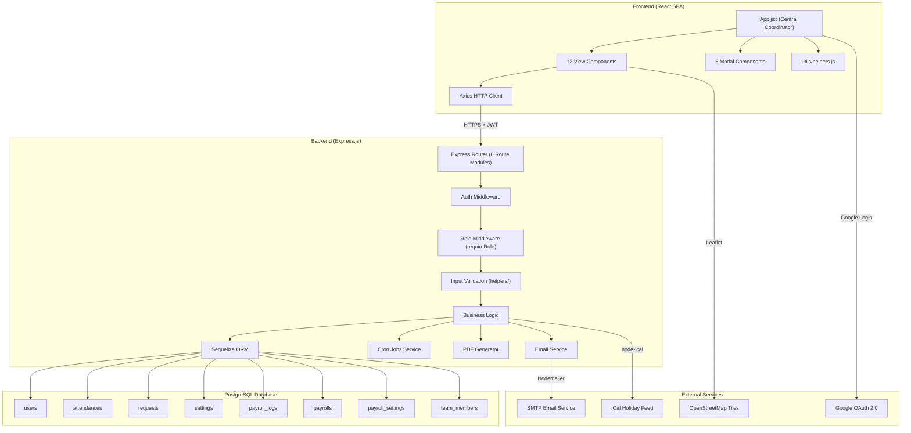
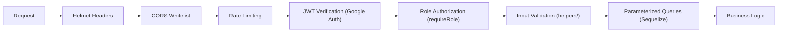

# Technical Specification Document (TSD)
## EMS — Employee Management System
**Version:** 3.1 (Post-Refactoring PERN Stack)
**Last Updated:** 28 Mei 2026

---

## 1. System Architecture

---

## 2. API Endpoints

Semua endpoint menggunakan prefix `/api`. Autentikasi dilakukan via `Authorization: Bearer <google-jwt-token>`.

### 2.1 Authentication
| Method | Path | Auth | Role | Deskripsi |
|--------|------|------|------|-----------|
| POST | `/api/auth/google` | ❌ | - | Login/Register via Google OAuth |

### 2.2 User Profile
| Method | Path | Auth | Role | Deskripsi |
|--------|------|------|------|-----------|
| PUT | `/api/users/profile` | ✅ | All | Update profil pribadi |

### 2.3 Attendance
| Method | Path | Auth | Role | Deskripsi |
|--------|------|------|------|-----------|
| POST | `/api/attendance/submit` | ✅ | All | Clock In / Clock Out |
| GET | `/api/attendance/history` | ✅ | All | Riwayat absensi per email + bulan/tahun |
| GET | `/api/attendance/summary/today` | ✅ | All | Ringkasan kehadiran hari ini |
| GET | `/api/attendance/summary/monthly` | ✅ | Admin/HRD/Manager | Laporan kehadiran bulanan seluruh karyawan |
| GET | `/api/attendance/summary/daily` | ✅ | Admin/HRD/Manager | Laporan kehadiran harian seluruh karyawan |

### 2.4 Employees
| Method | Path | Auth | Role | Deskripsi |
|--------|------|------|------|-----------|
| GET | `/api/employees` | ✅ | Admin/HRD/Manager | Daftar seluruh karyawan |
| PUT | `/api/employees/:id` | ✅ | Admin/HRD | Update data karyawan (posisi, departemen, dll) |
| DELETE | `/api/employees/:id` | ✅ | Admin | Hapus karyawan |
| PUT | `/api/employees/:id/payroll` | ✅ | Admin/HRD | Update data payroll karyawan (gaji, bank, BPJS, dll) |

### 2.5 Requests (Leave, Permit, etc.)
| Method | Path | Auth | Role | Deskripsi |
|--------|------|------|------|-----------|
| POST | `/api/requests` | ✅ | All | Buat permohonan baru |
| GET | `/api/requests` | ✅ | All | Riwayat permohonan milik user |
| GET | `/api/requests/pending` | ✅ | Admin/Manager | Daftar permohonan pending (untuk approval) |
| PUT | `/api/requests/:id/status` | ✅ | Admin/Manager | Approve, Reject, atau Return permohonan |
| GET | `/api/requests/recent` | ✅ | All | Aktivitas terbaru (untuk dashboard feed) |
| GET | `/api/requests/active-leave` | ✅ | All | Karyawan yang sedang cuti hari ini |

### 2.6 Payroll
| Method | Path | Auth | Role | Deskripsi |
|--------|------|------|------|-----------|
| POST | `/api/payroll/calculate` | ✅ | Admin/HRD | Hitung payroll (semua atau selektif per ID) |
| GET | `/api/payroll/records` | ✅ | Admin/HRD/Manager | Ambil data payroll per periode |
| GET | `/api/payroll/my-payslip` | ✅ | All | Payslip pribadi + history 6 bulan |
| PUT | `/api/payroll/:id/finalize` | ✅ | Admin/HRD | Finalize single payroll record |
| PUT | `/api/payroll/finalize-all` | ✅ | Admin/HRD | Finalize semua Draft |
| PUT | `/api/payroll/:id/mark-paid` | ✅ | Admin/HRD | Mark single payroll sebagai Paid |
| PUT | `/api/payroll/mark-all-paid` | ✅ | Admin/HRD | Mark semua Finalized sebagai Paid |
| PUT | `/api/payroll/:id/mark-unpaid` | ✅ | Admin/HRD | Revert single payroll ke Draft |
| PUT | `/api/payroll/mark-all-unpaid` | ✅ | Admin/HRD | Revert semua Paid/Finalized ke Draft |
| GET | `/api/payroll/:id/pdf` | ✅ | All* | Download payslip PDF (*employee hanya miliknya) |
| POST | `/api/payroll/send-emails` | ✅ | Admin/HRD | Kirim slip gaji massal via email |
| GET | `/api/payroll/export-bank` | ✅ | Admin/HRD | Export file bank transfer (CSV/TXT) |
| GET | `/api/payroll/logs` | ✅ | Admin/HRD | Audit log operasi payroll |
| GET | `/api/payroll/cron-status` | ✅ | Admin | Status cron jobs yang berjalan |

### 2.7 Settings & Schedule
| Method | Path | Auth | Role | Deskripsi |
|--------|------|------|------|-----------|
| GET | `/api/settings/office` | ✅ | All | Ambil pengaturan lokasi kantor |
| PUT | `/api/settings/office` | ✅ | Admin/HRD | Update lokasi kantor (lat, lng, radius) |
| GET | `/api/settings/workdays` | ✅ | All | Ambil pengaturan hari kerja |
| PUT | `/api/settings/workdays` | ✅ | Admin/HRD | Update hari kerja |
| GET | `/api/settings/payroll` | ✅ | Admin/HRD | Ambil pengaturan payroll global |
| PUT | `/api/settings/payroll` | ✅ | Admin/HRD | Update pengaturan payroll global |
| GET | `/api/schedule/holidays` | ✅ | All | Ambil hari libur nasional (via iCal) |

---

## 3. Security Architecture

### 3.1 Security Layers

### 3.2 Security Implementations

| Layer | Technology | Detail |
|-------|-----------|--------|
| **HTTP Headers** | Helmet.js | XSS protection, clickjacking prevention, MIME sniffing |
| **CORS** | express-cors | Whitelist: `localhost:5173`, production URL, `FRONTEND_URL` env |
| **Rate Limiting** | express-rate-limit | General: 200/15min, Auth: 20/15min |
| **Authentication** | Google OAuth 2.0 | JWT token verification via `google-auth-library` |
| **Authorization** | Custom middleware | `requireRole()` — role-based route protection (di `middleware/auth.js`) |
| **Input Validation** | Custom validators | `helpers/validation.js` — validasi profil, employee, payroll, request |
| **Injection Protection** | Sequelize ORM | Parameterized queries via Sequelize ORM mencegah raw SQL Injection |

---

## 4. Frontend Architecture

Berbasis **React 19 + Vite 8** menggunakan `App.jsx` sebagai central state coordinator.

### 4.1 View Components (12 komponen)

| Komponen | Fungsi |
|----------|--------|
| `LoginPage.jsx` | Halaman login Google OAuth |
| `Sidebar.jsx` | Navigasi sidebar dengan sub-menu |
| `TopNavbar.jsx` | Navbar atas (hamburger, user info, logout) |
| `Dashboard.jsx` | Dashboard utama (Feed + My Info/Absensi) |
| `ProfileView.jsx` | Halaman profil karyawan |
| `EmployeeView.jsx` | Manajemen daftar karyawan |
| `PayrollView.jsx` | Manajemen payroll (My Payslip + Manage) |
| `LeaveView.jsx` | Permohonan cuti/izin & approval |
| `AttendancePersonal.jsx` | Riwayat absensi personal per bulan |
| `AttendanceReport.jsx` | Laporan absensi bulanan (admin/HRD) |
| `DailyReport.jsx` | Laporan absensi harian (admin/HRD) |
| `ScheduleView.jsx` | Kalender dengan hari libur nasional |

### 4.2 Modal Components (5 komponen)

| Komponen | Fungsi |
|----------|--------|
| `EditProfileModal.jsx` | Form edit profil pribadi |
| `EditEmployeeModal.jsx` | Form edit data karyawan (admin) |
| `EditPayrollModal.jsx` | Form edit payroll karyawan (admin) |
| `OfficeSettingsModal.jsx` | Pengaturan lokasi kantor & hari kerja |
| `RequestModal.jsx` | Form pengajuan cuti/izin/lembur |

---

## 5. Environment Variables

### Server (.env)

| Variable | Required | Description |
|----------|----------|-------------|
| `PORT` | ❌ | Server port (default: 5000) |
| `DATABASE_URL` | ✅ | PostgreSQL connection string |
| `GOOGLE_CLIENT_ID` | ✅ | Google OAuth Client ID |
| `FRONTEND_URL` | ❌ | Production frontend URL (CORS whitelist) |
| `ALLOW_OPEN_REGISTRATION` | ❌ | `true` = open registration (default: restricted) |
| `NODE_ENV` | ❌ | `production` enables HTTPS redirect |
| `ENABLE_CRON` | ❌ | `true` to activate automated cron jobs |
| `EMAIL_USER` | ❌ | SMTP email address untuk kirim payslip |
| `EMAIL_PASS` | ❌ | SMTP password/app password |
| `EMAIL_HOST` | ❌ | SMTP host (default: smtp.gmail.com) |
| `EMAIL_PORT` | ❌ | SMTP port (default: 587) |

### Client (.env)

| Variable | Required | Description |
|----------|----------|-------------|
| `VITE_API_URL` | ✅ | Backend API base URL |
| `VITE_GOOGLE_CLIENT_ID` | ✅ | Google OAuth Client ID |
