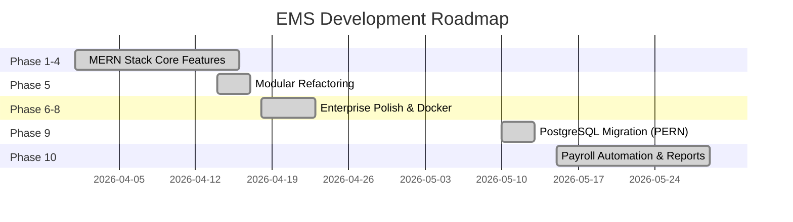

# Development Stage Roadmap
## EMS — Employee Management System
**Last Updated:** 28 Mei 2026

---

## Timeline Overview

---

## Phase 9: PostgreSQL Migration (PERN) ✅

| Task | Status | Detail |
|------|--------|--------|
| Setup PostgreSQL Database | ✅ | Mengganti MongoDB Atlas dengan Supabase/PostgreSQL |
| Install Sequelize ORM | ✅ | Mengganti Mongoose dengan Sequelize, pg, pg-hstore |
| Define Relational Models | ✅ | Membuat tabel User, Attendance, Request, dll dalam format SQL |
| Update API Controllers | ✅ | Menyesuaikan Mongoose queries (`findById`, `find`) menjadi Sequelize (`findByPk`, `findAll`) |
| Migrate Relationships | ✅ | Mendefinisikan asosiasi Foreign Key di `models/index.js` |

---

## Phase 10: Payroll Automation & Reports ✅

| Task | Status | Detail |
|------|--------|--------|
| Payroll Engine | ✅ | Kalkulasi otomatis gaji, tunjangan, BPJS, PPh21 |
| Modular Routes | ✅ | Refactoring routing ke folder `server/routes/` (6 file) |
| Auth Middleware | ✅ | Memindahkan middleware ke `server/middleware/auth.js` |
| Input Validation | ✅ | Helper validasi di `server/helpers/validation.js` |
| PDF Generator | ✅ | Generate payslip PDF dengan branding (PDFKit) |
| Email Service | ✅ | Kirim payslip massal via SMTP (Nodemailer) |
| Bank Transfer Export | ✅ | Export file BCA (CSV) dan Mandiri (TXT) |
| Daily Report | ✅ | Laporan kehadiran per tanggal spesifik |
| Payroll Settings | ✅ | Konfigurasi global rates (late penalty, overtime, dll) |
| Audit Logging | ✅ | PayrollLog untuk tracking semua operasi payroll |
| Cron Jobs | ✅ | Attendance reminder (08:30) & auto payroll calculation (tgl 25) |

---

*(Fase 1 hingga 8 sama dengan roadmap sebelumnya yang telah diselesaikan).*

